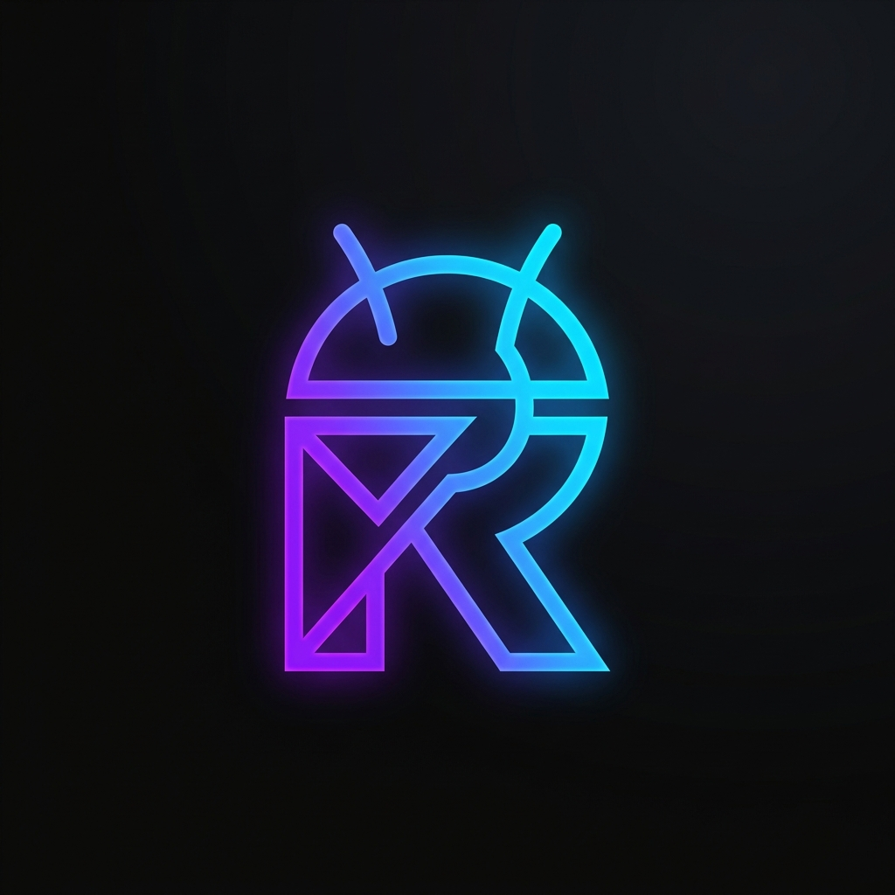

<div align="center">
  
  <h1>Raj Vaibhav Rai</h1>
  <p><strong>Senior Android Developer</strong></p>
  
  <p>
    <a href="https://rajvaibhavrai.site/"><b>Portfolio Website</b></a> •
    <a href="https://linkedin.com/in/rvrai"><b>LinkedIn</b></a> •
    <a href="mailto:rvrai1998@gmail.com"><b>Email</b></a>
  </p>

  <p>
    
    
    
    
  </p>
</div>

<br/>

## 🚀 About Me

Senior Android Developer with **5+ years of experience** building scalable, high-performance mobile applications using **Kotlin** and **Java**. 

Expertise in **MVVM, Clean Architecture, Coroutines, Flow, Jetpack Compose, Room, Hilt, Firebase, REST APIs**, and modern Android development practices.

---

## 💼 Experience

- **Software Developer** @ *Rupyz Fintech Private Limited* (May 2024 - Present)
- **Android Developer** @ *Techahead Software Private Limited* (Apr 2023 - May 2024)
- **Android Developer** @ *CEDCOSS Technologies Private Limited* (Aug 2020 - Apr 2023)
- **Android Developer** @ *Coding Brains* (Sep 2019 - Aug 2020)

---

## 🛠️ Tech Stack & Skills

- **Languages:** Kotlin, Java
- **Architecture & Principles:** MVVM, Clean Architecture, SOLID Principles
- **Modern Android:** Jetpack Compose, Material Design, Coroutines, Flow, DataStore, Room
- **Dependency Injection:** Dagger / Hilt
- **Networking:** REST API Integration, Retrofit
- **Cloud & Backend:** Firebase
- **Tools & Methodologies:** GIT / Github, JIRA / Figma, Agile / Scrum

---

## 📱 Featured Projects

| Project | Description |
| ------- | ----------- |
| **HappyMob** | A platform for businesses to register and search local businesses. |
| **Kido Protect Parental Control** | Parental control application for screen monitoring and restrictions. |
| **DolledUp** | Social-commerce Android application integrating content and shopping. |
| **Magenative Shopify App** | Mobile commerce builder for Shopify stores. |
| **Magenative Woocommerce App** | Sophisticated native Android solution for WooCommerce with dynamic experience. |
| **Classical Archive** | Premier platform for classical music enthusiasts worldwide. Curated collection, seamless streaming. |
| **ERP Base Attendance System** | Freelancing project for a third party to be introduced to the government. |

---

## 🎓 Education

- **B.Tech/B.E.** @ *ITM School of Management Lucknow* (2022)
- **12th** @ *CBSE Board* (2015)
- **10th** @ *CBSE Board* (2013)

---

---

## 📜 License & Release Note

This project is released under the **MIT License**. It is a permissive license that allows anyone to use, modify, and distribute the code freely. 

**Attribution Requirement:** You are required to give a **salutation/attribution** to the original author, **Raj Vaibhav Rai**, in your derivative projects or deployments.

---

## 🛠️ How To Implement

Follow these steps to set up your own version of this portfolio:

1.  **Clone the Repository:**
    ```bash
    git clone https://github.com/rvrai/Biodata.git
    cd Biodata
    ```
2.  **Database Initialization:**
    *   Create a project on [Supabase](https://supabase.com/).
    *   In the Supabase **SQL Editor**, execute the contents of `sql/database.sql`. This will create the schema, functions, and seed initial data.
3.  **Frontend Setup:**
    *   Navigate to `frontend/`.
    *   Create a `.env` file and add your credentials:
        ```env
        VITE_SUPABASE_URL=your_supabase_project_url
        VITE_SUPABASE_ANON_KEY=your_supabase_anon_key
        ```
    *   Run `npm install` and then `npm run dev`.
4.  **Deployment:**
    *   Connect your repository to **Netlify** or **Vercel**.
    *   Ensure the environment variables are set in the deployment dashboard.

---

## 🔐 How to Create Admin Login

To manage your portfolio content via the dashboard, you need an admin account:

1.  **Register User:**
    *   In your Supabase dashboard, go to **Authentication** > **Users**.
    *   Click **Add User** and create an account with your email and a password.
2.  **Grant Admin Privileges:**
    *   In the **SQL Editor**, run the following query (replace with your details):
        ```sql
        INSERT INTO public.user_roles (email, user_id, role)
        VALUES ('your-email@example.com', 'your-user-uuid', 'admin');
        ```
    *   You can find your `user-uuid` in the `auth.users` table.
3.  **Access Dashboard:**
    *   Visit `/admin` on your website.
    *   Log in with your credentials to start managing your data.

---

<div align="center">
  <i>Built with ❤️ & React & Supabase</i><br>
  <b><a href="https://rajvaibhavrai.site/">Visit Live Portfolio</a></b>
</div>
